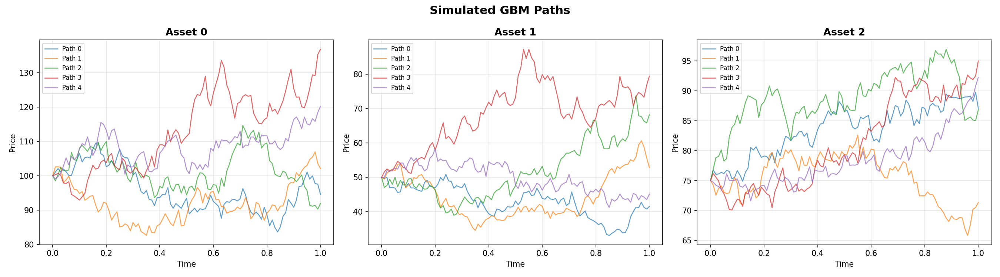
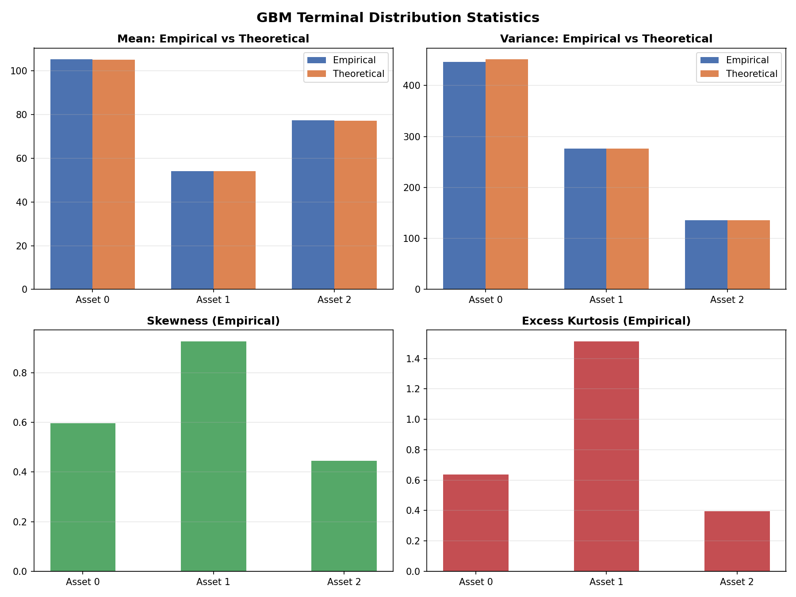
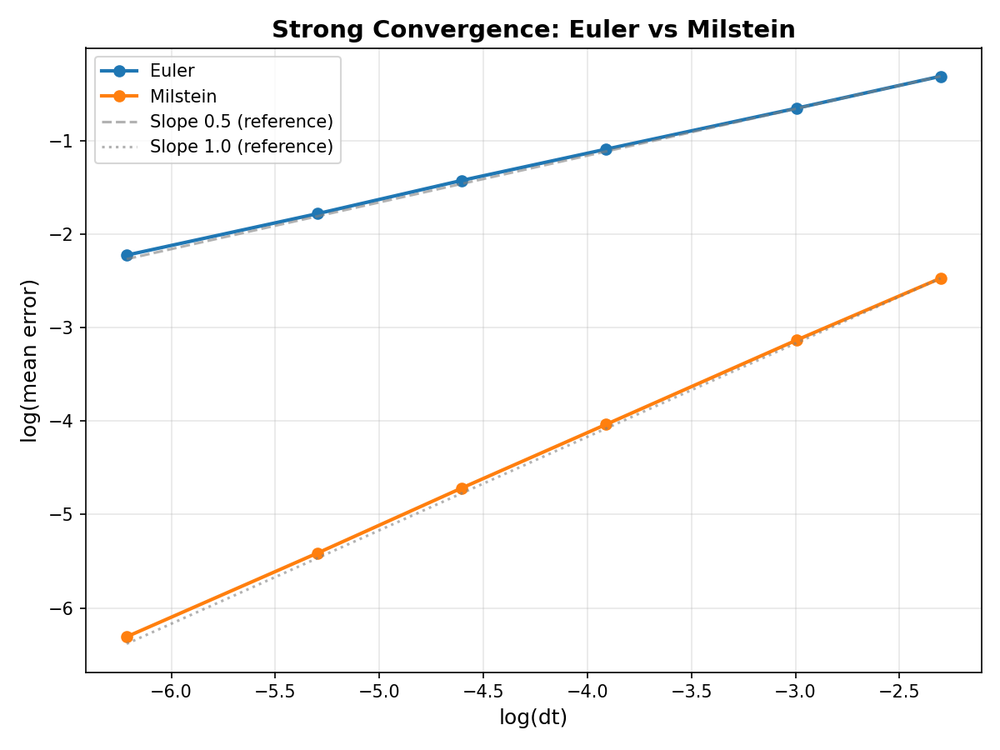

# GBM Path Simulator & Options Delta Hedging Analyzer

A high-performance C++17 framework that bridges stochastic calculus numerical methods with quantitative finance. It simulates **correlated multi-asset Geometric Brownian Motion (GBM)** using Monte Carlo methods (Euler–Maruyama and Milstein schemes), computes **empirical distribution statistics**, benchmarks **strong convergence rates**, and performs comprehensive **discrete dynamic Delta-Hedging backtests** with exact Greek-driven P&L attribution.

## Why is this project helpful?

This project serves as a practical workbench for quantitative finance exploration:
1. **SDE Numerical Methods**: It lets you observe computational finance first-hand, comparing exact analytical GBM solutions directly against Milstein and Euler-Maruyama approximations and testing how $dt$ limits impact convergence.
2. **Options Risk Management**: It moves beyond theoretical Black-Scholes pricing by simulating the realistic risk of *discrete* hedging. You can visualize how transaction costs and discrete rebalancing schedules cause a real-world delta-hedged portfolio to deviate from the theoretical risk-free rate.
3. **P&L Attribution**: By breaking hedging errors down into specific Greeks (like earning Theta carry vs. bleeding Gamma), you can rigorously analyze *why* a hedged derivative position made or lost money over a stochastic path.
4. **C++ / Python Hybrid Architecture**: It demonstrates how to perform high-speed, type-safe Monte Carlo computations in a compiled language (C++) while cleanly serializing structured data via JSON/CSV for rich, exploratory data visualization in Python.

---

## Mathematical Model

Each asset follows GBM:

$$dS_t^{(i)} = \mu_i \, S_t^{(i)} \, dt + \sigma_i \, S_t^{(i)} \, dW_t^{(i)}$$

With correlated Brownian motions: $\text{Corr}(dW^{(i)}, dW^{(j)}) = \rho_{ij}$

### Exact Solution (Reference)

$$S_T^{(i)} = S_0^{(i)} \cdot \exp\!\left((\mu_i - \tfrac{1}{2}\sigma_i^2)T + \sigma_i W_T^{(i)}\right)$$

### Numerical Schemes

**Euler–Maruyama:**

$$S_{n+1} = S_n + \mu S_n \Delta t + \sigma S_n \Delta W_n$$

**Milstein:**

$$S_{n+1} = S_n + \mu S_n \Delta t + \sigma S_n \Delta W_n + \tfrac{1}{2}\sigma^2 S_n \left((\Delta W_n)^2 - \Delta t\right)$$

### Correlated Brownian Motion

At each time step: generate $z \sim \mathcal{N}(0, I)$, compute Cholesky factor $L$ of correlation matrix, then $\Delta W = \sqrt{\Delta t} \cdot L z$.

---

## Project Structure

```
├── include/
│   ├── gbm.hpp               # GBM model, config, exact solution
│   ├── sde_integrator.hpp    # Euler & Milstein stepping + path simulation
│   ├── cholesky.hpp          # Cholesky decomposition interface
│   ├── statistics.hpp        # Empirical & theoretical moment computations
│   ├── convergence.hpp       # Convergence benchmark runner
│   ├── bs/                   # Options Math
│   │   ├── black_scholes.hpp # Analytical pricing & Greeks
│   │   ├── normal.hpp        # CDF/PDF utilities
│   │   └── payoff.hpp        # Call/Put payoff logic
│   └── hedging/              # Backtesting Engine
│       ├── delta_hedger.hpp  # Discrete rebalancing logic
│       ├── hedging_runner.hpp# Monte Carlo backtest driver
│       ├── pnl_attribution.hpp # Attribution data structures
│       └── report_generator.hpp# JSON export utility
├── src/
│   ├── cholesky.cpp          # Cholesky decomposition
│   ├── convergence_runner.cpp# Convergence analysis
│   ├── statistics.cpp        # Moment computations
│   ├── rng.cpp               # Random number generation
│   ├── time_grid.cpp         # Time step logic
│   ├── bs/                   # Options Math Implementation
│   │   ├── black_scholes.cpp
│   │   ├── normal.cpp
│   │   └── payoff.cpp
│   └── hedging/              # Backtesting Implementation
│       ├── delta_hedger.cpp
│       ├── hedging_runner.cpp
│       └── report_generator.cpp
├── tests/
│   ├── test_integrator.cpp   # SDE scheme verification
│   ├── test_cholesky.cpp     # Correlation engine verification
│   ├── test_statistics.cpp   # Distributional moment checks
│   ├── test_black_scholes.cpp # Analytical price/Greek validation
│   └── test_hedging.cpp      # Attribution identity & MC convergence
├── scripts/
│   ├── plot_paths.py         
│   ├── plot_convergence.py   
│   ├── plot_stats.py         
│   └── plot_hedging.py       
├── data/                     # Output Data & Visualizations
│   ├── stats.csv             # Moment analysis results
│   ├── paths.csv             # Sample GBM trajectories
│   ├── convergence.csv       # SDE error benchmarks
│   ├── hedging_pnl.csv       # Monte Carlo hedging distribution
│   ├── pnl_attribution.csv   # Greek attribution breakdown
│   ├── hedging_report.json   # Full metadata & result summary
│   └── *.png                 # Generated plots (paths, stats, P&L)
├── main.cpp                  # Full simulation driver
└── CMakeLists.txt
```

## Build

```bash
mkdir -p build && cd build
cmake ..
make -j4
```

## Run

```bash
# Execute the full simulation and reporting pipeline
./gbm_simulator
```

## Run Tests

You can run the entire suite via CTest:
```bash
cd build
ctest --output-on-failure
```

Or run individual component tests for targeted debugging:
```bash
./build/test_integrator    # SDE Numerical Schemes
./build/test_cholesky      # Choleky & Correlation
./build/test_statistics    # GBM Theoretical Moments
./build/test_black_scholes # BS Pricing & Greeks
./build/test_hedging       # Delta Hedging & P&L Attribution
```

## Python Plots

Requires `pandas` and `matplotlib`. Using a virtual environment:

```bash
python3 -m venv .venv
source .venv/bin/activate
pip install pandas matplotlib
python3 scripts/plot_paths.py
python3 scripts/plot_convergence.py
python3 scripts/plot_stats.py
python3 scripts/plot_hedging.py
```

## CSV & JSON Outputs

All outputs are written to `data/`:

| File | Structure / Columns |
|---|---|
| `convergence.csv` | `dt`, `scheme`, `mean_error`, `rmse`, `log_dt`, `log_error` |
| `stats.csv` | `asset_id`, `mean_empirical`, `mean_theoretical`, ... |
| `paths.csv` | `path_id`, `time`, `asset_id`, `value` |
| `hedging_pnl.csv` | `path_id`, `terminal_pnl` |
| `pnl_attribution.csv` | `component`, `mean_value` |
| `hedging_report.json` | Detailed configuration metadata and backtest summaries |

## Configuration

Simulation parameters are defined in `main.cpp` via the `GBMConfig` struct:

| Parameter | Description |
|---|---|
| `num_assets` | Number of correlated assets (M) |
| `num_paths` | Number of Monte Carlo paths (N) |
| `num_steps` | Time discretization steps |
| `T` | Maturity time |
| `S0` | Initial prices per asset |
| `mu` | Drift per asset |
| `sigma` | Volatility per asset |
| `correlation_matrix` | M × M correlation matrix |
| `scheme` | `Scheme::Euler` or `Scheme::Milstein` |

## Theoretical Moments (GBM)

$$\mathbb{E}[S_T] = S_0 \, e^{\mu T}$$

$$\text{Var}(S_T) = S_0^2 \, e^{2\mu T}\left(e^{\sigma^2 T} - 1\right)$$

## Convergence

Strong convergence is measured as:

$$\text{error} = \frac{1}{N}\sum_{i=1}^{N} |S_T^{\text{numerical}} - S_T^{\text{exact}}|$$

Expected convergence orders:
- **Euler–Maruyama**: O(Δt^0.5)
- **Milstein**: O(Δt^1.0)

## Results and Visualizations

The `data/` directory contains sample PNG plots generated from running the simulation described in `main.cpp`.

### 1. Simulated GBM Paths

**Input Configuration:**
- **Assets:** 3 correlated assets
- **Paths:** 10,000 Monte Carlo paths
- **Time Steps:** 100 steps over $T=1.0$
- **Initial Prices ($S_0$):** $\{100.0, 50.0, 75.0\}$
- **Drift ($\mu$):** $\{0.05, 0.08, 0.03\}$
- **Volatility ($\sigma$):** $\{0.2, 0.3, 0.15\}$
- **Correlation Matrix:**
  $$ \begin{bmatrix} 1.0 & 0.5 & 0.2 \\ 0.5 & 1.0 & -0.3 \\ 0.2 & -0.3 & 1.0 \end{bmatrix} $$



### 2. Empirical Distribution Statistics

Comparing the empirical mean, variance, skewness, and kurtosis of the simulated terminal prices against the theoretical exact moments. Data output is saved to `data/stats.csv`.



### 3. Strong Convergence

**Input Configuration:**
- **Assets:** 1 asset
- **Paths:** 10,000 reference paths for exact solution comparison
- **Time Steps ($N$):** 10, 20, 50, 100, 200, 500 over $T=1.0$
- **Scheme:** Euler–Maruyama

The plot demonstrates the expected strong convergence rate for the selected numerical scheme ($\mathcal{O}(\Delta t^{0.5})$ for Euler). Data output is saved to `data/convergence.csv`.



### 4. Options Hedging P&L Distribution

**Input Configuration:**
- **Paths:** 5,000 Monte Carlo paths
- **Time Steps:** 100
- **Scheme:** Delta Hedging (Option vs Stock with strict transaction caching)

Displays the terminal P&L variance across 5000 fully-hedged option portfolios due to discretization error (rebalancing only 100 times over maturity instead of continuously). Data output is saved to `data/hedging_pnl.csv`.


### 5. Expected Options P&L Attribution (Greeks)

Decomposes the core hedging identity ($Theta + Gamma + Financing$), isolating structural loss and gain mechanics through simulated standard deviations and expected returns. Data output is saved to `data/pnl_attribution.csv`.


---

## Development Phases

This project was built iteratively across several phases:
- **Phase 1: Project Structuring & Mathematics:** Establised the foundational architecture and numerical integration loops (Euler-Maruyama & Milstein). Added to solve analytical stochastic equations.
- **Phase 2: Statistical Verification:** Implemented central moment trackers. Added to verify that our numerical engines properly capture expected means, variances, skewness, and kurtosis against analytical Black-Scholes limits.
- **Phase 3: Multi-Asset & Cholesky Decomposition:** Shifted from 1D random walks to a vectorized `N`-dimensional walk with full correlation tracking. Added because a robust pricing system requires basket option limits.
- **Phase 4: Black-Scholes Core:** Developed strict OOP classes for option pricing and exact Greek extraction (Delta, Gamma, Theta, Vega, Rho). Added to serve as the benchmark metrics for any hedging simulator.
- **Phase 5: P&L Attribution & Backtesting:** Constructed the `DeltaHedger` and simulation engine. Added to rigorously backtest the cost of discretized rebalancing and calculate exactly how market friction and step-sizes degrade theoretical hedging.
- **Phase 6: Reporting & Visualizations:** Built a strict JSON serialization schema from the C++ loops and matching Python plotting engines. Added because visualizing numerical outputs is critical to interpreting underlying SDE mechanics.
